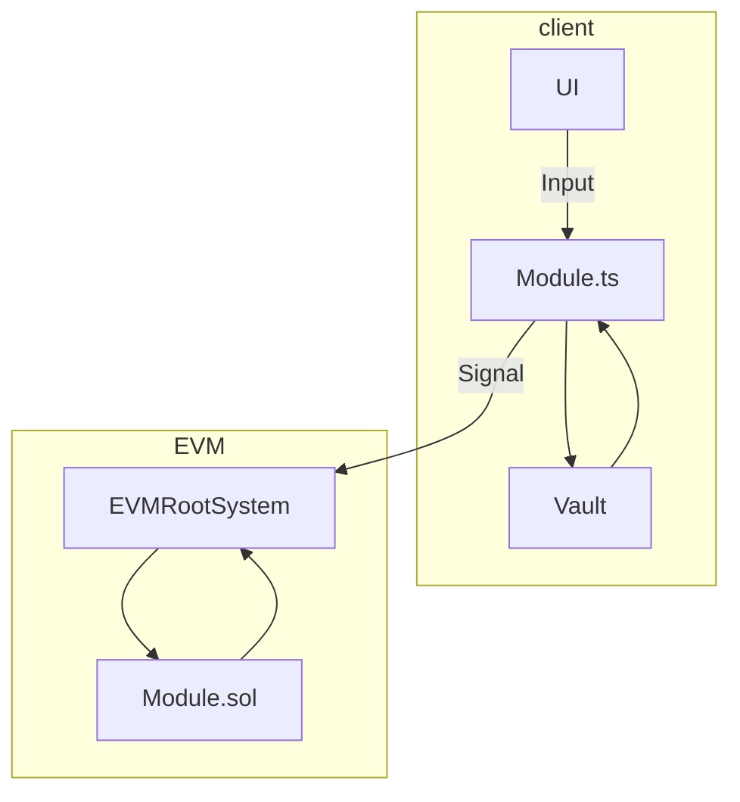
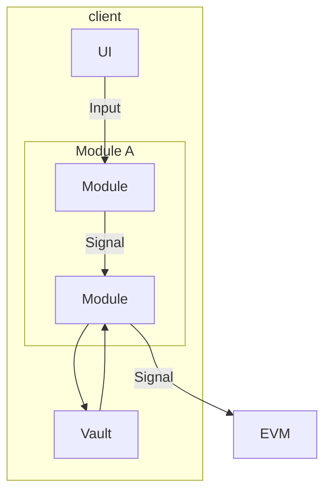
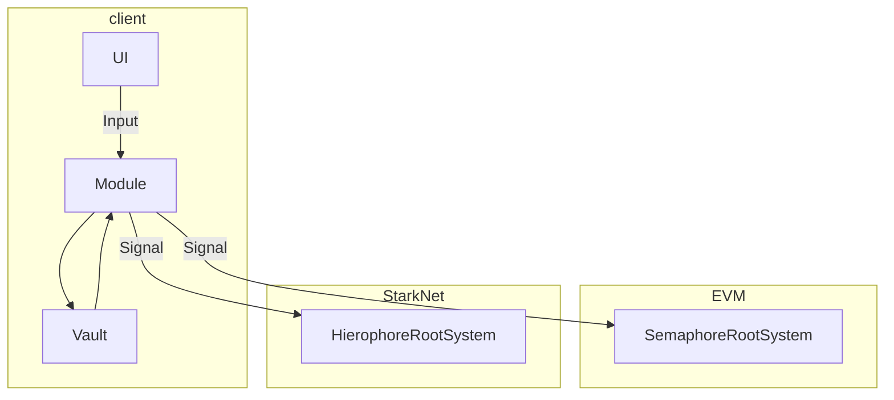
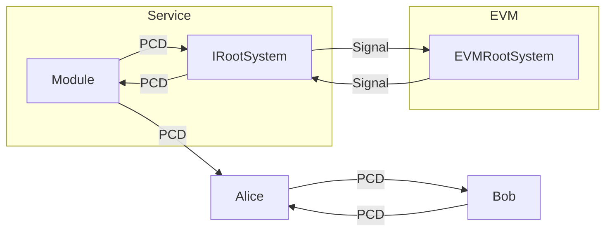
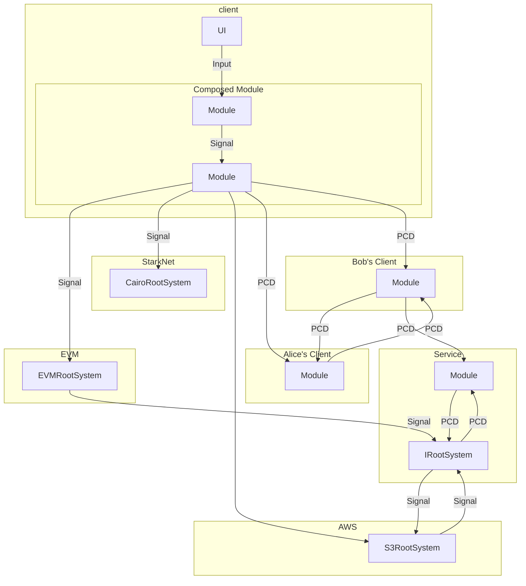

This document is meant to give a high-level intuition about what Gribi does today, how it works and why.

>Caveat: Gribi is not production ready. Gribi is still in alpha stages and has been opened to the public for early developer feedback.

> Because Gribi is very new, design choices have been made quite intentionally to allow for maxmimum flexibility and simplicity. Remember, premature optimization is the root of all evil! Think of this structure as young pliable bones which will harden and set as the framework matures.

> It is possible to build a proof of concept applications with Gribi, but the experience of building with and using Gribi is best when done in the repository [gribi-playground](https://github.com/tonk-gg/gribi-playground). This respository will also help you to understand how all the different parts fit together in the code.

<!-- TOC start (generated with https://github.com/derlin/bitdowntoc) -->

- [What is Gribi?](#what-is-gribi)
   * [A framework](#a-framework)
   * [A design pattern](#a-design-pattern)
- [What can I use Gribi for today?](#what-can-i-use-gribi-for-today)
   * [EVMRootSystem](#evmrootsystem)
   * [Commit-Update-Reveal module](#commit-update-reveal-module)
   * [MUD Integration](#mud-integration)
- [Join the Gribi ecosystem](#join-the-gribi-ecosystem)
- [Overview of Architecture](#overview-of-architecture)
   * [Gribi's EVMRootSystem and Example Modules](#gribis-evmrootsystem-and-example-modules)
      + [Vault](#vault)
      + [Module](#module)
      + [RootSystem](#rootsystem)
      + [Signal](#signal)
- [Some handy features ](#some-handy-features)
   * [Using modules in other modules ](#using-modules-in-other-modules)
   * [Using Gribi in the Starknet ecosystem](#using-gribi-in-the-starknet-ecosystem)
   * [Propagating information](#propagating-information)
- [Trust infrastructure](#trust-infrastructure)

<!-- TOC end -->

# What is Gribi?

Gribi is an SDK for building trust infrastructure, but you can think of this SDK as both a framework and as a design pattern.

## A framework

You can think of Gribi as a framework for adding hidden state to your onchain game or decentralised app, so that you don't have to get into the cryptographic weeds. Gribi is really a set of ready-made components and build tools that streamline your ability to work with _Gribi modules_. 

As mentioned before, modules (in the context of Gribi) are a predefined way of generating and sending proofs that represent an idiosyncratic "information behaviour", somewhat akin to packages. This behaviour could be a hidden information mechanic in an onchain game, but could be many other distinctive ways for information to propagate and information asymmetries to build up / erode.

Certain components of this modular design pattern should be common to all apps, and are non-trivial to build, such as a Vault to keep and protect private information on the user's device.

## A design pattern

You can also think of Gribi as a set of interfaces describing a modular design pattern for advanced cryptographic systems and applications. 

Modules in this design pattern are meant to:
- Interoperate with each other
- Compose into each other
- Encapsulate complex behavior

Modules are distributed and consumed via external package managers. Currently there is only a Gribi library in Typescript (so most modules should be in NPM).

Modules may communicate directly with each other or they may communicate with something called a RootSystem, which provides a unified interface to external stateful systems (e.g. Ethereum, AWS, etc).

After a year of prototyping various apps and games that incorporate ZK, we've felt firsthand the unique pains and strains that go with applied cryptography. We've carefully picked the abstractions and distinctions that separate each component of the Gribi design pattern to streamline development, sidestepping the need for monoliths, middleware and bespoke cryptographic logic.

# What can I use Gribi for today?

You can use Gribi to more easily add hidden information to your onchain game or any other decentralised app without compromising on all the qualities that make onchain development special. In order for Gribi to be useful, it first needs some modules and rootsystems, and if you're already using a state manager such as MUD or Dojo, you may need to integrate Gribi into that framework too.

We've already done some of the groundwork here for you, including a pre-prepared EVMRootsystem, Commit-Update-Reveal module and a MUD integration.

## EVMRootSystem

As mentioned before, a rootsystem is an interface that encapsulates the behavior of external networks or systems, such as a blockchain or S3 instance. Gribi provides a rootsystem available out-of-the box.

The EVMRootSystem is a rootsystem for interacting with the EVM. It bundles the typical structures used when building any zkApp:
- Merkle trees
- An on-chain verifier
- Kernel circuit 
- Noir libraries

This bundle of functionality is exposed through a rootsystem interface, allowing for modules to programmatically define a range of behaviors using verified off-chain compute with zero-knowledge proofs. 

## Commit-Update-Reveal module

The current example module in the [tonk-gg/gribi-playground/playground/module](https://github.com/tonk-gg/gribi-playground/tree/main/playground/module) expresses commit-update-reveal behavior, where a player may commit to some state (e.g. location) and then make all subsequent updates (new locations) to the commitment via ZK proofs. This functionality allows for constraining private, off-chain state, such as hidden player movement, according to the logic of a Noir circuit.

No one ever said you had to build a module from scratch! Building more complex cryptographic applications out of combinations of modules and abstractions over a rootsystem can take away the pain of building cryptographic apps.

## MUD Integration

[MUD](https://mud.dev) is a framework for building ambitious onchain applications created by the Lattice team.

The MUD integration package is available for use with the EVMRootSystem, but remains incomplete and requires some manual setup. You may look at the [gribi-playground](https://github.com/tonk-gg/gribi-playground) for an example of how to integrate into a MUD game.

# Join the Gribi ecosystem

If you are building an advanced cryptographic system, writing and publishing a set of interfaces as modules with Gribi opens your cryptographic "stuff" up to other modules in the Gribi world and allows their cryptographic "stuff" to do interesting things in your system. That makes your system immediately more expressive and powerful. 

# Overview of Architecture

This overview of the architecture will briefly describe the main constituent parts and tell a story of increasing complexity to illustrate the philosophy of Gribi.

## Gribi's EVMRootSystem and Example Modules



### Vault
Often times in cryptography the participant, player or user is required to handle some data which only they must know. A private key is the most common example, but as our cryptographic applications become increasingly complex the amount of user side information grows quite quickly. 

The Vault is meant to organize user secrets for storage and retrieval and protect them from prying eyes. 

Note: at present, the vault is a functional PoC and insecure.

### Module
A module is any NPM package which exposes cryptographic "stuff" through any set (or subset) of the Gribi interfaces. For example, in the EVMRootSystem, modules must configure logic on both the client and on the chain. It doesn't need to be this way, that's just how the EVMRootSystem was designed.

### RootSystem
A RootSystem is a simple interface which exposes the behavior of an underlying stateful system as a set of atomic transactions or operations.

### Signal
A signal is used to structure atomic transactions or operations of a RootSystem. In the EVMRootSystem, Signals are structured as StateUpdates, which optionally may use a recursive proof.

```typescript
export interface Signal<
    O = any,
> {
    transform?(inputs?: Signal[]): Promise<Signal<O>[]>;
    output: O;
}
```

```typescript
export type StateUpdate = {
  id: Field,
  method: string,
  inputs: PublicInput[],
  operations: Operation[],
  proof?: ProofData 
}
```

# Some handy features 

## Using modules in other modules 

A great example of this might be a module which takes the "commit-update-reveal" module and uses it to define a much simpler "hidden player movement" module. I can expose a simple interface with just hide(x,y) and reveal() functions and a short update circuit which constrains movement to be no greater distance from previous location than 1. Under the hood, the commit-update-reveal module is doing everything else for us.



## Using Gribi in the Starknet ecosystem

In the EVMRootSystem, modules must define extra onchain logic as part of their module, but let's say we create a new RootSystem for Semaphore (to anonymously prove group membership) which doesn't require any extra logic outside the client. Now if someone comes along and decides they'd like to have their groups natively in Starknet, they can create a new RootSystem to assist in proving set membership and all the existing modules that were built for the SemaphoreRootSystem will just work.

This is especially powerful when we're not just duplicating state, but signaling information across ecosystems which may then continue to propagate further.



## Propagating information

RootSystems can also signal back to clients. Remember, a signal is just an operation or transform on some data. In the case where RootSystems transmit a signal it's a receipt of some transform or operation. Gribi defines an interface to receive these receipts and transform them into a new data type called PCD.

PCD, or "Proof-Carrying Data", are self-evident blobs of data — that is, data which carries with itself a proof of its computation. PCD was first described by Alessandro Chiesa and only recently codified into a JSON format by the 0xParc PCD team. Gribi uses a more generalized version of the PCD SDK format in the hopes of helping to define an emergent standard.

PCDs are an excellent tool to federate bits of verified computation out to non-native networks and systems. 



A PCD in Gribi is defined as a JSON blob which has the following structure. The proof in the JSON is expected to validate or prove the claim. The procedure used to validate the claim with the proof is defined by the PCD's URI.

A PCD's URI looks as follows `pcd://{namespace}/{type}/{unique_hash}` and consists of three elements:
- A **namespace**, which may typically refer to the source application (e.g. Semaphore)
- A **type**, referring to the logical method within that namespace
- A **unique_hash**, which allows for indexing PCDs
```
export interface PCD<C = unknown, P = unknown> {    
    uri: PCDURI;
    claim: C;
    proof: P;
  }
```

# Trust infrastructure

If we smash all of these together, we get something which starts to look like a web of authoritative and expressive messages. You can began to express strange scenarios like:

1. "I can join semaphore group X only if I get a high score in the game A" 
2. "Prove I am in the high score group to get access to a website"
3. "The website describes a secret incantation which I can use to hide my players location in game B for 5 turns"


